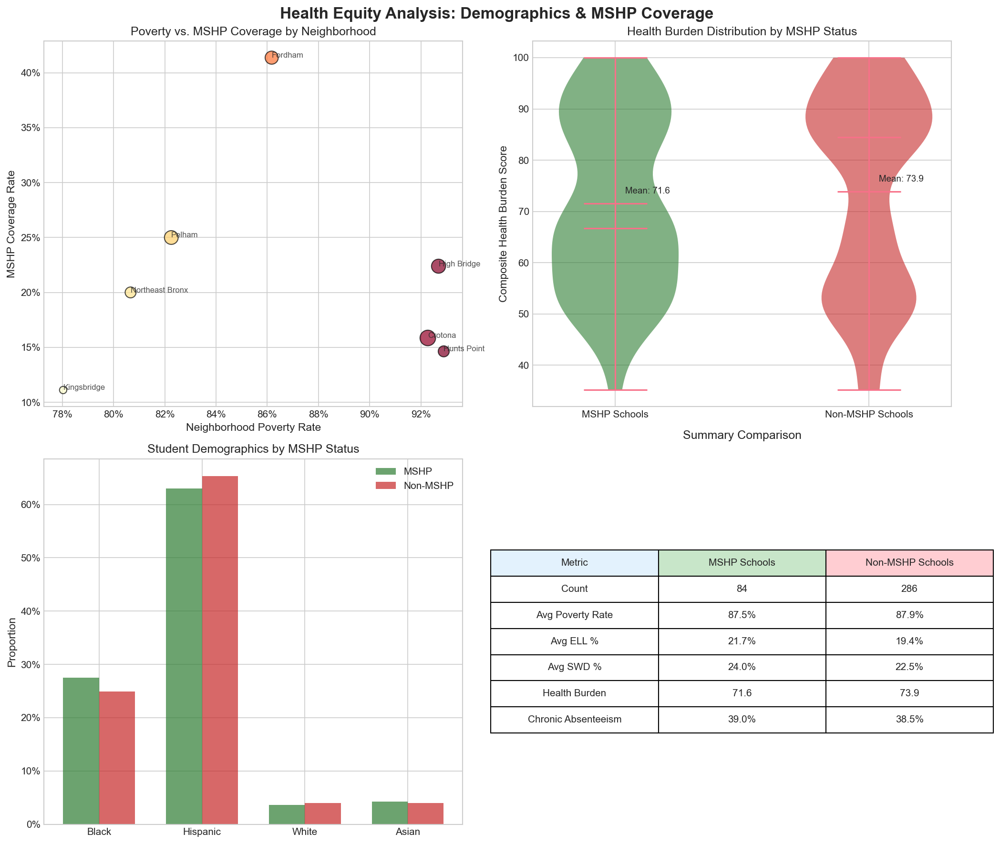

# The MSHP Coverage Gap

## Mapping the Unfinished Promise of School-Based Healthcare in the Bronx

[](https://www.python.org/downloads/release/python-3110/)
[](https://opensource.org/licenses/MIT)
[](https://opendata.cityofnewyork.us/)

<p align="center">
  
</p>

---

## Project Overview

This project analyzes the geographic distribution of the **Montefiore School Health Program (MSHP)** across Bronx public schools, identifying coverage gaps in neighborhoods with the highest childhood asthma burden and chronic absenteeism.

### Key Questions
1. Are schools WITHOUT MSHP coverage in higher-need neighborhoods?
2. Is there a relationship between MSHP coverage and chronic absenteeism?
3. Which schools should be prioritized for MSHP expansion?
4. What is the causal effect of MSHP on student outcomes?

---

## Key Findings

### Coverage Statistics
| Metric | Value |
|--------|-------|
| Total Bronx Schools | **370** |
| MSHP Covered | **84** (23%) |
| Not Covered | **286** (77%) |
| Tier 1 Priority Schools | **58** |

### Main Results

1. **MSHP targets high-need areas** 
   - Schools in highest-asthma neighborhoods (Hunts Point, Morrisania) have MSHP coverage
   - This reflects successful equity targeting by Montefiore

2. **No significant absenteeism difference**
   - MSHP mean: 38.99%
   - Non-MSHP mean: 38.45%
   - p-value: 0.70 (not significant)

3. **Dose-response trend**
   - Schools with longer MSHP exposure show lower absenteeism
   - r = -0.17 (suggestive but not significant)

4. **Coverage gaps exist**
   - Hunts Point - Mott Haven: Only 15% coverage despite highest asthma burden
   - 22 schools in "health deserts" (>1 mile from nearest MSHP)

---

## Interactive Maps

### [View the Interactive Coverage Map →](outputs/interactive/mshp_coverage_gap_map_enhanced.html)

Features:
- Choropleth layer showing asthma burden by neighborhood
- School markers colored by MSHP status
- Tier 1 priority schools highlighted with pulsing markers
- Multiple base map options (dark, light, satellite)
- Layer toggle controls

### [View the Enhanced Priority Map →](outputs/interactive/enhanced_priority_map.html)

Features:
- SVI-colored neighborhood choropleth
- Enhanced priority tier markers
- Accessibility radius visualization

---

## Project Structure

```
mshp-coverage-gap/
├──  data/
│   ├── raw/                    # Original downloaded data
│   ├── processed/              # Cleaned analysis-ready files
│   ├── manual/                 # MSHP school list
│   └── geo/                    # Geographic boundaries
│
├──  outputs/
│   ├── figures/                # Static visualizations (13 PNG files)
│   ├── interactive/            # HTML maps (3 interactive maps)
│   └── tables/                 # CSV summary tables
│
├──  scripts/                 # Numbered pipeline scripts (14 scripts)
│
├──  docs/
│   ├── data_dictionary.md      # Field definitions
│   ├── methodology.md          # Analysis methods
│   └── limitations.md          # Known limitations
│
├──  configs/
│   └── params.yml              # All parameters and thresholds
│
└──  tests/                   # Unit tests
```

---


### 1. Clone the Repository
```bash
git clone https://github.com/yourusername/mshp-coverage-gap.git
cd mshp-coverage-gap
```

### 2. Create Environment
```bash
conda env create -f environment.yml
conda activate mshp-gap
pip install -e .
```

### 3. Run the Analysis Pipeline
```bash
make all
```

Or run individual steps:
```bash
make collect    # Data collection
make process    # Data processing
make analyze    # Statistical analysis
make visualize  # Generate maps and charts
```

---

## Data Sources

| Dataset | Source | API/Link |
|---------|--------|----------|
| School Locations | NYC Open Data | [wg9x-4ke6](https://data.cityofnewyork.us/Education/2024-2025-School-Locations/wg9x-4ke6) |
| MSHP School List | NYC DOE SBHC Document | [PDF](https://www.schools.nyc.gov/docs/default-source/default-document-library/nyc-school-based-health-centers-sbhcs-2025-2026.pdf) |
| Chronic Absenteeism | NYC DOE InfoHub | [Download](https://infohub.nyced.org/) |
| Asthma Data | NYC DOHMH EHDP | [GitHub](https://github.com/nychealth/EHDP-data) |
| UHF Boundaries | NYC Health | [GitHub](https://github.com/nychealth/coronavirus-data) |
| School Demographics | NYC Open Data | [c7ru-d68s](https://data.cityofnewyork.us/Education/2017-18-2021-22-Demographic-Snapshot/c7ru-d68s) |

---

## Methodology

### Priority Ranking Formula
Schools are ranked for MSHP expansion based on:

```
Priority Score = 0.25 × Asthma Burden +
                 0.25 × Social Vulnerability +
                 0.20 × Chronic Absenteeism +
                 0.15 × Geographic Isolation +
                 0.15 × Enrollment Size
```

### Causal Inference Methods
1. **Propensity Score Analysis** - Predicted probability of MSHP selection
2. **Inverse Probability Weighting (IPW)** - Adjusted for selection bias
3. **Stratification** - Effects within comparable school groups
4. **Dose-Response** - Years of MSHP exposure vs. outcomes

See [docs/methodology.md](docs/methodology.md) for full details.

---

## Visualizations

### Static Figures
| Figure | Description |
|--------|-------------|
| `demographics_comparison.png` | Demographics by MSHP status |
| `health_burden_heatmap.png` | Health indicators by neighborhood |
| `causal_inference_summary.png` | Treatment effect estimates |
| `propensity_scores.png` | Propensity score distributions |
| `health_equity_composite.png` | Comprehensive equity dashboard |
| `priority_tier_distribution.png` | Schools by priority tier |
| `neighborhood_coverage_gap.png` | Coverage gaps by area |

### Interactive Maps
| Map | Description |
|-----|-------------|
| `mshp_coverage_gap_map.html` | Basic coverage visualization |
| `mshp_coverage_gap_map_enhanced.html` | Enhanced with dark theme, pulsing markers |
| `enhanced_priority_map.html` | SVI overlay with priority tiers |

---

## Key Outputs

### Priority Schools for MSHP Expansion
Top 5 highest-priority schools (Tier 1 Critical):

| Rank | School | Neighborhood | Priority Score |
|------|--------|--------------|----------------|
| 1 | H.E.R.O. High | Hunts Point - Mott Haven | 94.1 |
| 2 | Bronx Studio School for Writers and Artists | High Bridge - Morrisania | 88.9 |
| 3 | P.S. 048 Joseph R. Drake | Hunts Point - Mott Haven | 88.9 |
| 4 | Hostos-Lincoln Academy of Science | Hunts Point - Mott Haven | 88.6 |
| 5 | The Longwood Academy of Discovery | Hunts Point - Mott Haven | 87.6 |

Full list: [outputs/tables/non_mshp_schools_priority_ranked.csv](outputs/tables/non_mshp_schools_priority_ranked.csv)

---

## Limitations

1. **Cross-sectional data** - Cannot prove causation
2. **Ecological fallacy** - Health data is neighborhood-level, not school-level
3. **Selection bias** - MSHP placement is intentionally targeted to high-need areas
4. **Temporal mismatch** - Data sources from different years

See [docs/limitations.md](docs/limitations.md) for full discussion.

---

## Contributing

Contributions are welcome! Please:
1. Fork the repository
2. Create a feature branch
3. Submit a pull request

---

## License

This project is licensed under the MIT License - see [LICENSE](LICENSE) for details.

---

## Contact

For questions about this analysis, please open an issue or contact the repository maintainer.

---

## Acknowledgments

- **Montefiore School Health Program** - For their ongoing work serving Bronx students
- **NYC Department of Education** - For making school data publicly available
- **NYC Department of Health and Mental Hygiene** - For health data access
- **NYC Open Data** - For the open data platform

---


